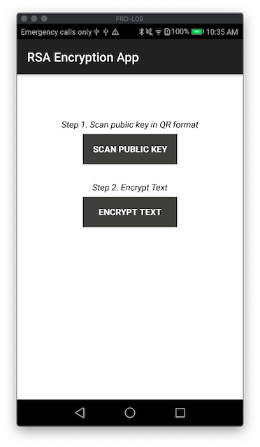
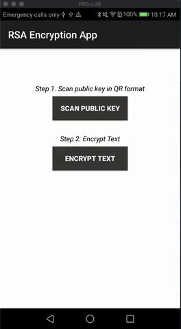

# RSA-Encryption App 

The RSA Encryption app demonstrates how to use RSA encryption to encrypt plain text in:
<ul>
  <li>Base64 encoded text</li>
  <li>QR code format</li>
</ul>
The app is structured into two modules or steps:
<ol>
  <li>Scanning of the RSA public key in QR code format</li>
  <li>Text encoding</li>
</ol>

<h2>Libraries</h2>
The app uses <a href="https://github.com/zxing/zxing">ZXing ("Zebra Crossing")</a> barcode scanning library to scan the QR codes. 

<h2>Use</h2>
<ol>
  <li>Download the repository and open it with Android Studio.</li>
  <li>In the app-level build.gradle change the name of the app from "com.example.movebetweenactivities" to your preferred name.</li>
  <li>Register the app with <a href="https://firebase.google.com/docs/android/setup">Firebase</a>, download the .json file and add it to the <b>app/</b> folder. 
</ol> 

The app uses several scanning activities, which is why it is recommended that you deploy the app on an Android device. If you decide to use the Android emulator, you can scan the codes using the front camera. In order to do, you need to change the camera settings of the emulator to the computer's webcam. Go to <i>Tools > AVD Manager</i> and select the "pencil" to get to <i>Virtual Device Configuration</i>. <i>Show Advanced Settings > Camera</i> will give you the option of using emulated, webcam0 or none. Select Webcam0 for the Front camera.

Press run. The rest of the instructions are shown on the screen. 
 

 

<b>Step 1</b>: As a first step, you will have to scan the public key in QR format. One example can be found under the <a href="https://github.com/daz261/RSA-Encryption/tree/master/Test%20RSA-Encryption">Test RSA-Encryption/</a> folder. 
<b>Step 2</b>: On the second screen, type the text that you want to encode. Select the encapsulation method from the dropdown menu: base64 encoded or QR code encrypted text. 

<h2>Resourcess</h2>
<ul>
  <li><a href="https://www.devglan.com/online-tools/rsa-encryption-decryption">Online RSA Encryption, Decryption And Key Generator Tool </a> </li>  
</ul>
  
